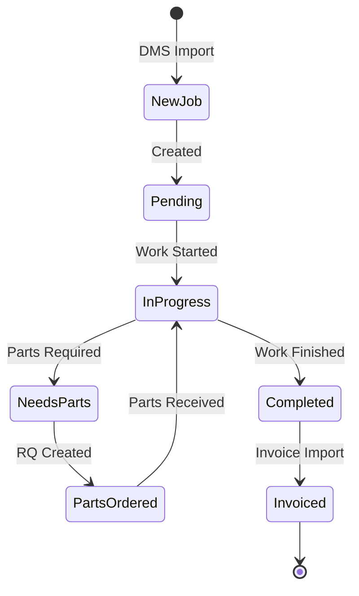
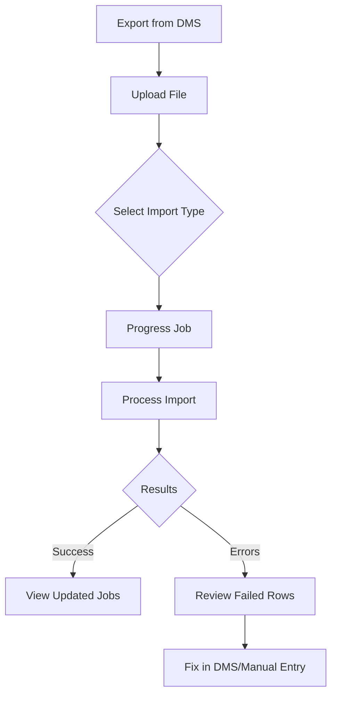
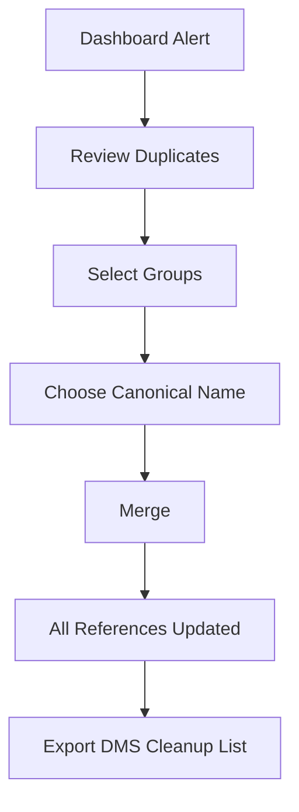
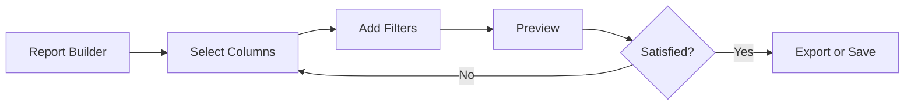

# Control Tower - Workflow Guide

Step-by-step operational workflows for common tasks in Control Tower.

---

## Table of Contents

1. [Daily Operations](#1-daily-operations)
2. [Job Management Workflows](#2-job-management-workflows)
3. [Data Import Workflows](#3-data-import-workflows)
4. [Customer Management Workflows](#4-customer-management-workflows)
5. [Reporting Workflows](#5-reporting-workflows)
6. [Administration Workflows](#6-administration-workflows)

---

## 1. Daily Operations

### Morning Routine

**Steps:**

1. **Export Data from DMS**
   - Export "Progress Job" sheet from DMS to Excel/ODS
   - Export any invoiced data if needed

2. **Import into Control Tower**
   - Go to **Operations → Import → Upload**
   - Upload Progress Job file
   - Monitor progress, review results

3. **Review Dashboard**
   - Check stats cards for job counts
   - Review aging chart for overdue jobs
   - Check "Needs Parts" section

4. **Handle Duplicates** (if alert shown)
   - Click "Review & Merge"
   - Merge detected duplicates
   - Export cleanup list for DMS team

5. **Assign Work**
   - Open Kanban board
   - Drag jobs to appropriate status
   - Add remarks as needed

---

### End of Day Routine

1. **Invoice Marking**
   - Export invoiced jobs from DMS
   - Import with "Invoiced" type
   - Verify daily invoice counts

2. **Status Update**
   - Review Kanban for stuck jobs
   - Add remarks on pending items
   - Flag stale jobs

3. **Reports** (Control Tower/Admin)
   - Generate uninvoiced report
   - Export for management review

---

## 2. Job Management Workflows

### Job Lifecycle

### Create Job Manually

1. Go to **Jobs → Create New**
2. Fill required fields:
   - WIP (Job Number)
   - Plate Number
   - Customer Name
   - Service Advisor
3. Add optional details
4. Click **Save**

### Update Job Status

**Via List:**
1. Go to **Jobs**
2. Select jobs (checkboxes)
3. Click **Bulk Actions**
4. Select new work status
5. Confirm update

**Via Kanban:**
1. Go to **Jobs → Kanban View**
2. Drag job card to new column
3. Status updates automatically

### Add Remark to Job

1. Open job detail page
2. Scroll to **Remarks** section
3. Enter remark text
4. Click **Add Remark**
5. Remark appears with your name/role

### Mark Job as Needing Parts

1. Open job detail page
2. Check **Needs Part** checkbox
3. Fill Order & Parts section:
   - RQ number
   - Order Part MBINA
   - Other notes
4. Save changes

### Export Job to PDF

1. Open job detail page
2. Click **Export PDF** button
3. PDF downloads with all job details

---

## 3. Data Import Workflows

### Import Progress Job (Uninvoiced)

**Steps:**

1. **Export from DMS**
   - Open DMS system
   - Export "Progress Job" report
   - Save as Excel (.xlsx) or ODS

2. **Upload to Control Tower**
   - Go to **Operations → Import → Upload**
   - Select file
   - Choose **Progress Job** import type

3. **Process Import**
   - Click **Import**
   - Watch progress bar
   - Wait for completion

4. **Review Results**
   - Check success/failed counts
   - Click "View Details" for import summary
   - Review failed rows if any

5. **Handle Failures**
   - Note error messages
   - Fix data in DMS or add manually
   - Re-import if needed

### Import Invoiced Jobs

**Purpose:** Mark jobs as invoiced and create invoice records

1. Export invoiced data from DMS
2. Go to **Operations → Import → Upload**
3. Select file, choose **Invoiced** type
4. Import processes:
   - Matches jobs by WIP
   - Updates status to "invoiced"
   - Creates invoice record
5. Review results

### Import Bookings

1. Export Booking sheet from spreadsheet
2. Upload with **Booking** import type
3. System creates booking records
4. View at **Operations → Bookings**

### Import PDI Records

1. Export PDI sheet
2. Upload with **PDI** import type
3. Records created for new vehicle inspections
4. View at **Operations → PDI**

### Import Towing Records

1. Export Towing sheet
2. Upload with **Towing** import type
3. Towing records created
4. View at **Operations → Towing**

---

## 4. Customer Management Workflows

### Find Customer

1. Use **Global Search** (Ctrl+K)
2. Type customer name
3. Click result to view details

**OR**

1. Go to **Customers**
2. Use search box
3. Click customer row

### View Customer History

1. Open customer detail page
2. View sections:
   - Stats (jobs, vehicles, sales)
   - Vehicles list
   - Job history with amounts

### Merge Duplicate Customers

**Steps:**

1. **Review Duplicates**
   - Click dashboard alert or go to **Customers → Duplicates**
   - View grouped similar names

2. **Select Groups to Merge**
   - Toggle checkbox for each group
   - All similar names in group will merge

3. **Choose Canonical Name**
   - Select correct spelling from dropdown
   - This becomes the official name

4. **Execute Merge**
   - Click **Merge All Selected**
   - Confirm action
   - All jobs/vehicles updated

5. **Generate Cleanup Report**
   - Go to **Reports → Customer Merges**
   - Filter by "DMS Import" source
   - Export to Excel/PDF
   - Send to DMS team for source data cleanup

### Dismiss False Duplicates

1. Go to **Customers → Duplicates**
2. Find incorrectly grouped names
3. Click **Dismiss Group**
4. Group won't appear again

---

## 5. Reporting Workflows

### Generate Standard Report

1. Go to **Reports** menu
2. Select report type:
   - Uninvoiced Jobs
   - Invoiced Jobs
   - Needs Parts
   - Aging Report
   - SA Performance
3. Apply filters
4. View results
5. Export if needed

### Build Custom Report

1. Go to **Reports → Report Builder**
2. **Select Columns**
   - Check desired fields
   - Drag to reorder
3. **Add Filters**
   - Choose field
   - Select operator (=, contains, >, etc.)
   - Enter value
4. **Preview**
   - Click Preview
   - Review results
5. **Save Configuration** (optional)
   - Enter report name
   - Click Save
   - Access later from saved list
6. **Export**
   - Choose format (Excel, CSV, PDF)
   - Download file

### Schedule Automated Report

1. Go to **Admin → Scheduled Reports**
2. Click **Create New**
3. Configure:
   - Report type
   - Schedule (daily/weekly/monthly)
   - Recipients (email addresses)
4. Enable the report
5. System sends automatically

### Export Aging Report

1. Go to **Reports → Aging**
2. View jobs grouped by age
3. Color coding:
   - Green: < 3 days
   - Blue: 3-7 days
   - Yellow: 7-14 days
   - Orange: 14-30 days
   - Red: > 30 days
4. Click job to view details
5. Export as needed

---

## 6. Administration Workflows

### Add New User (Local)

1. Go to **Admin → Users**
2. Click **Add User**
3. Fill details:
   - Name, Email, Username
   - Password
   - Role
4. Save

### Add User from LDAP

1. Go to **Admin → Users**
2. Click **Search LDAP**
3. Enter search term
4. Select user from results
5. Assign role
6. User can login with LDAP credentials

### Configure Backup Schedule

1. Go to **Admin → Backups**
2. Scroll to **Schedule Settings**
3. Configure:
   - Enable/disable scheduled backups
   - Set time
   - Retention period
   - Pruning rules
4. Save settings

### Create Manual Backup

1. Go to **Admin → Backups**
2. Click **Create Backup Now**
3. Wait for completion
4. Download backup file

### Restore from Backup

1. Go to **Admin → Backups**
2. Find backup in list
3. Click **Restore**
4. Confirm action
5. Wait for restoration

### Data Cleanup

> ⚠️ **Warning:** This permanently deletes data!

1. Go to **Admin → Data Cleanup**
2. Create backup first (required)
3. Select tables to clear
4. Confirm action
5. Selected data removed

### User Role Management

1. Go to **Admin → Roles**
2. Select or create role
3. Configure permissions:
   - **DocType Permissions**: What actions on which models
   - **Field Permissions**: Which fields editable
4. Save
5. Assign role to users

### View Audit Logs

1. Go to **Admin → Audit Logs**
2. Filter by:
   - User
   - Action (created, updated, deleted)
   - Model type
   - Date range
3. View changes with old/new values
4. Archive old logs as needed

---

## Quick Reference

| Task | Navigate To |
|------|-------------|
| Import data | Operations → Import |
| View all jobs | Jobs |
| Kanban board | Jobs → Kanban View |
| Merge duplicates | Customers → Duplicates |
| Uninvoiced report | Reports → Uninvoiced |
| Custom report | Reports → Report Builder |
| Manage users | Admin → Users |
| Configure backup | Admin → Backups |
| View audit trail | Admin → Audit Logs |
| Session management | Admin → Sessions |
